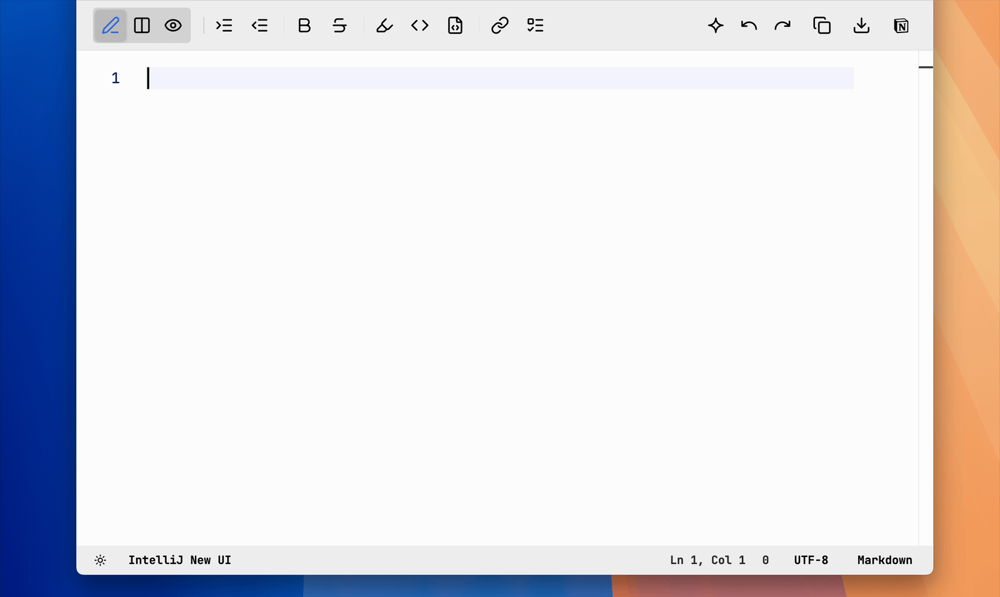
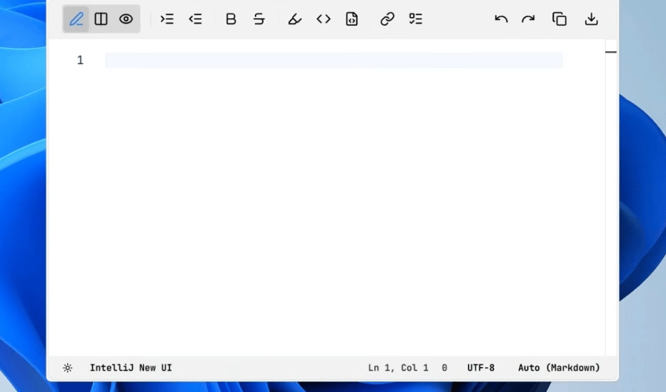
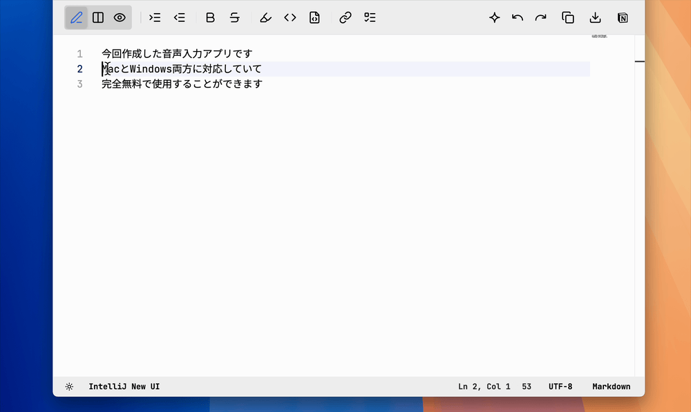

<!-- @format -->

<div align="center">
  

# KoeType

**声でタイピング** — macOS / Windows 向けの完全無料で使える音声入力アプリ

[](#macos)
[](#windows)

</div>



## 由来

語源: 日本語の「声でタイピング」。

macOS / Windows に対応した音声入力アプリです。
Whisper を利用したローカル音声認識と、Gemini API を利用したクラウド音声認識に対応しており、完全無料で使用することも可能です。
開発ストーリーや機能の説明については、こちらに詳しく書きましたので、ぜひご覧ください。

[完全無料の音声入力アプリリリースしてみた。](https://note.com/yasu_dev/n/n4ae017dbf841)

## サポート

KoeType は個人が趣味で開発・無償公開しているアプリです。気に入っていただけたら、開発継続の励みになりますのでコーヒー一杯分のご支援をいただけると嬉しいです。

<a href="https://www.buymeacoffee.com/koetype" target="_blank"></a>

---

## クイックスタート

### 配布パッケージでインストール

**macOS:**

1. GitHub Releases から最新の `.dmg` をダウンロード
2. `KoeType.app` を `Applications` に移動
3. 起動後、設定画面の「初回セットアップ (macOS)」カードで権限確認を実行
4. Whisperモデルをダウンロード（初回のみ）

- [note記事](https://note.com/yasu_dev/n/n4ae017dbf841) で画像付きのセットアップ方法紹介。

**Windows:**

1. GitHub Releases から最新の `.exe`（インストーラー）または `.msi` をダウンロード
2. インストーラーを実行
3. 起動後、ショートカットキーとマイクを設定
4. Whisperモデルをダウンロード（初回のみ）

### pnpm でローカルビルド（開発者向け）

**macOS:**

**前提**: `pnpm`、Rust / Cargo、Xcode Command Line Tools が使える状態で、リポジトリを clone 済み。

```bash
pnpm install
pnpm macos:prepare-whisper-bundle
pnpm macos:rebuild-install
```

インストール後、システム設定で以下の権限を許可してください（自動でダイアログが開きます）。

- アクセシビリティ（グローバルショートカット・ペースト注入）
- マイク（音声録音）
- 音声認識（OS 標準ディクテーション連携）

**Windows:**

**前提**: `pnpm`、Rust / Cargo が使える状態で、リポジトリを clone 済み。

```powershell
pnpm install
pnpm tauri build
.\scripts\windows\install.ps1 -RegisterStartup -StartNow
```

### アップデート

配布パッケージ版（macOS: `.dmg` / Windows: `.msi` や `.exe`）は自動アップデートに対応していません。  
更新時は最新の配布パッケージを再ダウンロードし、上書きインストールしてください。  
macOS は `Applications` 内の `KoeType.app` を置き換えてください。  
設定・履歴などのデータは `~/.config/koetype/`（Windows は `%LOCALAPPDATA%\koetype\`）に保存されるため、通常はそのまま引き継がれます。

**macOS:**

```bash
git pull
pnpm install
pnpm macos:rebuild-install
```

**Windows:**

```powershell
git pull
pnpm install
pnpm tauri build
.\scripts\windows\install.ps1
```

---

## 目次

- [基本的な使い方](#基本的な使い方)
  - [初回設定](#初回設定)
  - [音声入力の流れ](#音声入力の流れ)
  - [ショートカットキー](#ショートカットキー)
- [機能詳細](#機能詳細)
  - [文字起こしモード](#文字起こしモード)
  - [ローカルWhisper](#ローカルwhisper)
    - [whisper-cli の導入](#whisper-cli-の導入)
    - [モデルのダウンロードと配置](#モデルのダウンロードと配置)
    - [配置確認](#配置確認)
    - [config.toml での詳細設定（任意）](#configtoml-での詳細設定任意)
    - [Whisper 実行確認・診断](#whisper-実行確認診断)
  - [入力方式](#入力方式)
  - [フローティングUI](#フローティングui)
  - [AI処理モード](#ai処理モード)
  - [トレイメニュー](#トレイメニュー)
  - [ユーザー辞書](#ユーザー辞書)
  - [履歴・統計](#履歴統計)
  - [サウンド](#サウンド)
  - [エラーログ](#エラーログ)
- [設定ファイル](#設定ファイル)
  - [config.toml 概要](#configtoml-概要)
  - [設定ファイル一覧](#設定ファイル一覧)
  - [APIキーの管理](#apiキーの管理)
  - [運用ガイド](#運用ガイド)
  - [バックアップ・移行](#バックアップ移行)
- [トラブルシューティング](#トラブルシューティング)
  - [権限関連（macOS）](#権限関連macos)
  - [ペーストが動かない](#ペーストが動かない)
  - [Whisperが動かない](#whisperが動かない)
  - [ログの確認方法](#ログの確認方法)
- [仕様](#仕様)
  - [対応OS・動作環境](#対応os動作環境)
  - [プラットフォーム差分](#プラットフォーム差分)
  - [対応言語](#対応言語)
  - [バージョン管理](#バージョン管理)
- [Third-party licenses](#third-party-licenses)
- [データの取り扱いについて](#データの取り扱いについて)
- [免責事項・利用条件](#免責事項利用条件)

---

## 基本的な使い方

### 初回設定

1. トレイアイコンをクリック → **設定** を開く
2. **文字起こしモード** を選択（`Gemini` または `Whisper (Local)` 推奨）
3. Gemini を選んだ場合: API キーとモデルを設定
4. Whisper を選んだ場合: モデルをセットアップ（[ローカルWhisper](#ローカルwhisper) 参照）
5. マイクを選択（Options タブ > Microphone）

### 音声入力の流れ

```
ショートカットを押す → 録音開始
  → ショートカットを離す（または再押し） → 録音停止
  → 文字起こし中（フローティングに表示）
  → アクティブアプリへ自動ペースト
```

### ショートカットキー

| 操作                            | macOS（既定）             | Windows（既定）         |
| ------------------------------- | ------------------------- | ----------------------- |
| PTT（長押しで録音）             | `左Cmd + 左Option`        | `左Ctrl + 左Win`        |
| Toggle（短押し 2 回で録音切替） | `左Cmd + 左Option` × 2    | `左Ctrl + 左Win` × 2    |
| 最後の文字起こしをペースト      | `左Cmd + 左Option` 短押し | `左Ctrl + 左Win` 短押し |

- ショートカットは設定画面でカスタマイズ可能
- PTT / Toggle / 短押しペーストは同一キーで判定（短押し 1 回: ペースト、短押し 2 回: Toggle、長押し: PTT）

---

## 機能詳細

### 文字起こしモード

設定画面の **文字起こしモード** で切り替えられます。

| 方式                | 説明                                          | 必要なもの                   |
| ------------------- | --------------------------------------------- | ---------------------------- |
| **Gemini**          | クラウド API で文字起こし。高速・高精度       | Gemini API キー              |
| **Whisper (Local)** | ローカル実行。API 不要、オフライン動作        | whisper.cpp + モデルファイル |
| **Hybrid**          | 録音時間の閾値で Whisper / Gemini を自動切替  | 両方の環境                   |
| **Collaborate**     | Whisper で文字起こし後、Gemini でテキスト整形 | 両方の環境                   |

**Gemini モデル選択肢**（設定画面で変更可能）:

- `gemini-2.5-flash-lite`（高速・低コスト）
- `gemini-2.5-flash`（バランス）
- `gemini-3-flash-preview`

### ローカルWhisper

API キー不要でオフライン動作します。

- macOS 配布版（DMG）: Whisper CLI + `large-v3-turbo-q5_0` を同梱しているため、追加セットアップなしで利用開始できます。
- 開発環境ビルド: 従来どおり初回セットアップが必要です。

既定の保存先:

- モデル: `~/.config/koetype/models/whisper/`
- 文字起こし蓄積: `~/.config/koetype/transcripts.jsonl`
- ログ: `~/.config/koetype/logs/whisper-cli.log`

#### whisper-cli の導入

**macOS（Homebrew・推奨）:**

```bash
brew install whisper-cpp
which whisper-cli
whisper-cli --help
```

**Windows（推奨）:**

```powershell
.\scripts\windows\setup-whisper.ps1
```

`setup-whisper.ps1` は GPU バックエンドとモデルを対話的に選択し、以下に配置します。

- `%LOCALAPPDATA%\koetype\bin\whisper-cli.exe`
- `%LOCALAPPDATA%\koetype\models\whisper\<model>.bin`

#### モデルのダウンロードと配置

**macOS / Linux（large-v3-turbo 推奨）:**

```bash
mkdir -p ~/.config/koetype/models/whisper
curl -L \
  "https://huggingface.co/ggerganov/whisper.cpp/resolve/main/ggml-large-v3-turbo-q5_0.bin" \
  -o ~/.config/koetype/models/whisper/ggml-large-v3-turbo-q5_0.bin
```

**macOS / Linux（large-v3 高精度）:**

```bash
mkdir -p ~/.config/koetype/models/whisper
curl -L \
  "https://huggingface.co/ggerganov/whisper.cpp/resolve/main/ggml-large-v3-q5_0.bin" \
  -o ~/.config/koetype/models/whisper/ggml-large-v3-q5_0.bin
```

**Windows（手動配置する場合）:**

```powershell
$modelsDir = "$env:LOCALAPPDATA\koetype\models\whisper"
New-Item -ItemType Directory -Force -Path $modelsDir
Invoke-WebRequest `
  "https://huggingface.co/ggerganov/whisper.cpp/resolve/main/ggml-large-v3-turbo-q5_0.bin" `
  -OutFile "$modelsDir\ggml-large-v3-turbo-q5_0.bin"
```

#### 配置確認

```bash
# macOS / Linux
ls -lh ~/.config/koetype/models/whisper/
# ggml-large-v3-turbo-q5_0.bin  約 547MB
# ggml-large-v3-q5_0.bin        約 1.1GB
```

```powershell
# Windows
Get-ChildItem "$env:LOCALAPPDATA\koetype\models\whisper\"
```

推奨モデル:

| 環境                     | 推奨モデル                | ファイルサイズ |
| ------------------------ | ------------------------- | -------------- |
| Apple Silicon            | `large-v3-turbo` + `q5_0` | ~547MB         |
| CPU 中心（軽量ノート等） | `base` + `q5_0`           | 小             |

#### config.toml での詳細設定（任意）

**macOS:**

```toml
# 省略時は KOETYPE_HOME/bin -> Homebrew標準パス -> PATH の順に探索
whisper_cli_path = "/Users/you/.config/koetype/bin/whisper-cli"

# モデルを直接指定したい場合に使用
# whisper_model_path = "/Users/you/.config/koetype/models/whisper/ggml-large-v3-turbo-q5_0.bin"

# 言語固定（auto / ja / en）
# whisper_language = "auto"
```

**Windows（`%LOCALAPPDATA%\koetype\config.toml`）:**

```toml
[win]
# whisper_cli_path = 'C:\path\to\whisper-cli.exe'
# whisper_model_path = 'C:\path\to\ggml-large-v3-turbo-q5_0.bin'
# whisper_language = "auto"
```

#### Whisper 実行確認・診断

手動で文字起こしを試す場合:

```bash
./scripts/manage.sh setup:whisper
./scripts/manage.sh transcribe <audio-file> [ja|en|auto]
```

または配布用同梱アセットを用意する場合:

```bash
pnpm macos:prepare-whisper-bundle
```

**Windows:**

```powershell
Test-Path "$env:LOCALAPPDATA\koetype\bin\whisper-cli.exe"
```

環境変数で上書きする場合:

| 環境変数                      | 用途                             |
| ----------------------------- | -------------------------------- |
| `KOETYPE_HOME`                | データディレクトリ全体の切り替え |
| `KOETYPE_WHISPER_MODEL_PATH`  | アプリ本体が使うモデルを直指定   |
| `KOETYPE_WHISPER_CLI_PATH`    | whisper-cli のパスを指定         |
| `KOETYPE_WHISPER_OUTPUT_DIR`  | 出力ディレクトリの変更           |
| `KOETYPE_WHISPER_OUTPUT_BASE` | 1回実行時の出力ベース名を固定    |
| `KOETYPE_LOG_DIR`             | ログディレクトリの変更           |
| `KOETYPE_TRANSCRIPTS_PATH`    | 文字起こし蓄積先の変更           |

設定画面で文字起こしモードを `Whisper (Local)` に切り替えると以後ローカル実行されます。

### 入力方式

文字起こし後の「アクティブアプリへの入力」方式を設定できます（**macOS のみ**。Windows は Clipboard 固定）。

| 方式             | 説明                         | 特徴                           |
| ---------------- | ---------------------------- | ------------------------------ |
| **Type**（既定） | キー入力シミュレート         | クリップボード履歴を汚染しない |
| **Clipboard**    | クリップボード経由でペースト | 大量テキストで速い場合がある   |

### フローティングUI

<table width="100%">
  <tr>
    <th align="center">macOS</th>
    <th align="center">Windows</th>
  </tr>
  <tr>
    <td align="center" width="50%">
      
    </td>
    <td align="center" width="50%">
      
    </td>
  </tr>
  <tr>
    <td align="center">録音・文字起こしの状態をリアルタイムで表示するオーバーレイウィンドウです。</td>
    <td align="center">オーディオスペクトラムで表示するオーバーレイウィンドウです。</td>
  </tr>
</table>

- 常に最前面（全画面アプリ使用中も表示）
- Collapsed（最小表示）/ Expanded（拡大表示）の 2 状態
- Collapsed 時はフォーカスを奪わない（入力先を妨げない）

**状態表示**:

| 状態         | 意味                   |
| ------------ | ---------------------- |
| Idle         | 待機中                 |
| Recording    | 録音中                 |
| Transcribing | 文字起こし中           |
| Injecting    | 貼り付け中             |
| Done         | 完了                   |
| Error        | エラー（対処導線付き） |

**プラットフォーム別実装**:

| OS      | 実装                                   | 備考                        |
| ------- | -------------------------------------- | --------------------------- |
| macOS   | SwiftUI オーバーレイ（既定）           | OS 標準ディクテーション連携 |
| Windows | Tauri + オーディオスペクトラム（固定） | 音声入力を波形で可視化      |

### AI処理モード



テキストを選択した状態でショートカットを押すと、通常の文字起こしではなく AI 処理モードに入ります。

1. 選択テキストを取得
2. 録音した音声を文字起こし（音声指示として扱う）
3. 「音声指示 + 選択テキスト」を Gemini に送信して処理
4. 結果を選択範囲に上書きペースト

AI 処理に使うモデルは、文字起こしモデルとは別に設定画面で指定できます。

### トレイメニュー

メニューバー（macOS）/ タスクトレイ（Windows）アイコンからアクセスできます。

| 項目                                     | 説明                                             | 対応プラットフォーム |
| ---------------------------------------- | ------------------------------------------------ | -------------------- |
| 設定                                     | 設定ウィンドウを開く                             | 両方                 |
| 最後の文字起こしをペースト               | 直近の文字起こし結果をアクティブアプリへ貼り付け | 両方                 |
| 最後の OS 標準ディクテーションをペースト | 直近の OS 音声入力結果を貼り付け                 | macOS のみ           |
| マイク                                   | 入力デバイスのサブメニュー                       | 両方                 |
| Language                                 | 言語のサブメニュー（日本語 / English）           | 両方                 |
| Model                                    | Gemini モデルのサブメニュー                      | 両方                 |
| Sound (SE)                               | サウンド設定のサブメニュー                       | 両方                 |
| KoeType を終了                           | プロセスを終了                                   | 両方                 |

### ユーザー辞書

固有名詞・専門用語・人名などを登録すると、Gemini による文字起こし精度が向上します。

- 最大 1,000 件
- 設定画面から追加・削除・編集
- Gemini のプロンプトに自動反映

### 履歴・統計

文字起こし結果はすべて自動保存されます。

- **履歴**: 直近 30 日の入力を設定画面の History タブから確認・再利用
- **統計**: GitHub 風コントリビューショングラフ、文字数・利用回数・節約時間の集計（Stats タブ）
- 履歴のクリアは History タブから実行可能

### サウンド

録音開始・停止・完了・エラー時の効果音を設定できます。トレイメニューの **Sound (SE)** から切り替えられます。

| 設定            | 動作                             |
| --------------- | -------------------------------- |
| Always OFF      | サウンドなし                     |
| Always ON       | 常に再生                         |
| Fullscreen Only | フローティングが隠れている時のみ |

### エラーログ

エラーは `~/.config/koetype/error_log.json` に自動記録されます。設定画面の「エラーログ」タブからも確認できます。

---

## 設定ファイル

### config.toml 概要

アプリ設定は `~/.config/koetype/config.toml`（Windows: `%LOCALAPPDATA%\koetype\config.toml`）で管理します。

1 ファイルで OS 別設定を管理できます。

```toml
stt_provider = "whisper"
language = "ja"

# Whisper runtime options (optional)
whisper_cli_path = "/Users/you/.config/koetype/bin/whisper-cli"
whisper_model_path = "/Users/you/.config/koetype/models/whisper/ggml-large-v3-turbo-q5_0.bin"
whisper_output_dir = "/Users/you/.config/koetype/outputs/transcriptions"
whisper_log_dir = "/Users/you/.config/koetype/logs"
whisper_language = "auto" # auto / ja / en
whisper_transcripts_path = "/Users/you/.config/koetype/transcripts.jsonl"

[mac]
mic_sensitivity = 1.0
wave_motion_scale = 4.0

[win]
mic_sensitivity = 3.0
wave_motion_scale = 6.0
```

設定値の優先順位:

```
環境変数 > config.toml > アプリ既定値
```

### 設定ファイル一覧

| ファイル                                 | 用途                   |
| ---------------------------------------- | ---------------------- |
| `~/.config/koetype/config.toml`          | アプリ設定             |
| `~/.config/koetype/history.json`         | 入力履歴               |
| `~/.config/koetype/stats.json`           | 利用統計               |
| `~/.config/koetype/user_dictionary.json` | ユーザー辞書           |
| `~/.config/koetype/transcripts.jsonl`    | Whisper 文字起こしログ |
| `~/.config/koetype/error_log.json`       | エラーログ             |
| `~/.config/koetype/paste_diag.jsonl`     | 診断ログ               |

### APIキーの管理

Gemini API キーは `config.toml` には保存しません。以下の方法で供給します。

- 環境変数 `KOETYPE_GEMINI_API_KEY` または `GEMINI_API_KEY`
- または設定画面から入力（実行中メモリのみに保持）

### 運用ガイド

1. 設定を確認・編集する  
   `~/.config/koetype/config.toml` を開いて確認します。手編集後はアプリ再起動で反映が確実です。
2. 日常運用の方針  
   `config.toml` を正として管理し、環境変数は一時的な上書き用途に限定します。
3. 保存先を変える  
   `KOETYPE_HOME` を指定して起動すると、同じファイル構成で保存先を切り替えられます。

### バックアップ・移行

`~/.config/koetype/` をディレクトリごとバックアップすれば、設定・履歴・辞書・統計をまとめて復元できます。新しい環境でこのディレクトリを配置してから起動すると、ほぼ同じ状態で再開できます。

**保存先を変えたい場合**:

```bash
KOETYPE_HOME=/path/to/custom koetype
```

---

## トラブルシューティング

### 権限関連（macOS）

無料配布版は Apple 公証なしで配布しているため、初回起動時に警告が表示される場合があります。設定画面の「初回セットアップ (macOS)」カードに沿って進めてください。

KoeType の動作に必要な 3 つの権限があります。インストール時に自動でダイアログが開きますが、手動で確認する場合は **システム設定 > プライバシーとセキュリティ** を開いてください。

| 権限             | 用途                                   | 確認場所                                      |
| ---------------- | -------------------------------------- | --------------------------------------------- |
| アクセシビリティ | グローバルショートカット、ペースト注入 | プライバシーとセキュリティ > アクセシビリティ |
| マイク           | 音声録音                               | プライバシーとセキュリティ > マイク           |
| 音声認識         | OS 標準ディクテーション連携            | プライバシーとセキュリティ > 音声認識         |

権限を付与後も動作しない場合は、KoeType を一度オフにして再度オンにしてください。

### 更新方法

設定画面の「初回セットアップ (macOS)」カードにある **更新確認** ボタンから、最新の GitHub Releases を開けます。

### ペーストが動かない

1. macOS: アクセシビリティ権限を確認（オフ → オン で再許可）
2. 入力方式を **Clipboard** に切り替えて試す（設定画面 > 入力方式）
3. 文字起こし完了後、クリップボードにテキストが入っているか確認
4. 診断ログを確認: `~/.config/koetype/paste_diag.jsonl`

### フローティングUIが消えない

フローティングUIだけが残ってしまった場合は、ターミナルで次を実行してください。

```bash
pkill -f floating-overlay
```

### 開発時の復旧コマンド（最小）

開発中に挙動が不安定な場合は、次の順で復旧を試してください。

1. プロセスを停止（dev サーバ含む）

```bash
pkill -f koetype
```

2. ビルドキャッシュを削除

```bash
rm -rf dist node_modules/.vite
```

### Whisperが動かない

1. `whisper-cli` が正しくインストールされているか確認

   ```bash
   # macOS
   which whisper-cli

   # Windows (PowerShell)
   Test-Path "$env:LOCALAPPDATA\koetype\bin\whisper-cli.exe"
   ```

2. モデルファイルが正しい場所に配置されているか確認

   ```bash
   # macOS
   ls ~/.config/koetype/models/whisper/
   # ggml-large-v3-turbo-q5_0.bin  約 547MB
   ```

3. モデルのファイル名が設定と一致しているか確認
   - `Whisper large-v3-turbo (Local)`: `ggml-large-v3-turbo-q5_0.bin`
   - `Whisper large-v3 (Local・高精度)`: `ggml-large-v3-q5_0.bin`

4. パスを明示指定して再試行

   ```toml
   # macOS
   whisper_cli_path = "/your/path/to/whisper-cli"
   whisper_model_path = "/your/path/to/model.bin"
   ```

   ```toml
   # Windows
   [win]
   whisper_cli_path = 'C:\path\to\whisper-cli.exe'
   whisper_model_path = 'C:\path\to\model.bin'
   ```

### ログの確認方法

| ログ             | 場所                                     |
| ---------------- | ---------------------------------------- |
| エラーログ       | `~/.config/koetype/error_log.json`       |
| Whisper ログ     | `~/.config/koetype/logs/whisper-cli.log` |
| 診断ログ         | `~/.config/koetype/paste_diag.jsonl`     |
| macOS 起動ログ   | `/tmp/koetype.log`                       |
| macOS エラー出力 | `/tmp/koetype.err.log`                   |

---

## 仕様

### 対応OS・推奨環境

| OS      | 推奨環境              |
| ------- | --------------------- |
| macOS   | Apple Silicon / Intel |
| Windows | Windows 10 / 11       |

### プラットフォーム差分

| 項目               | macOS                       | Windows                        |
| ------------------ | --------------------------- | ------------------------------ |
| フローティング既定 | SwiftUI オーバーレイ        | Tauri + オーディオスペクトラム |
| 音声フィードバック | OS 標準ディクテーション連携 | スペクトラム表示               |
| 設定ファイル場所   | `~/.config/koetype/`        | `%LOCALAPPDATA%\koetype\`      |
| 自動起動           | LaunchAgent                 | スタートアップフォルダ         |

### 対応言語

- 日本語
- English

### バージョン管理

CalVer 形式: `YY.M.DD`（例: `26.2.26` → UI 表示 `ver. 2026-02-26`）

---

## Third-party licenses

- `whisper.cpp`: MIT License
  https://github.com/ggml-org/whisper.cpp
- `OpenAI Whisper`: MIT License
  https://github.com/openai/whisper
- モデルファイル（GGML）は配布元の利用規約・ライセンスに従って利用してください。

---

## データの取り扱いについて

本アプリで処理される音声・テキストのデータが「KoeType」開発元に送信されることは一切ありません。

### ローカル保存されるデータ

設定情報・利用統計・ユーザー辞書・エラーログ・文字起こし履歴は、すべてユーザーの PC 上にのみ保存されます。サーバー等への送信は行いません。

| OS      | 保存先                    |
| ------- | ------------------------- |
| macOS   | `~/.config/koetype/`      |
| Windows | `%LOCALAPPDATA%\koetype\` |

### 文字起こしモード別の通信内容

| モード              | 外部通信                                                                                                |
| ------------------- | ------------------------------------------------------------------------------------------------------- |
| **Whisper (Local)** | なし。音声処理はすべてローカルで完結します                                                              |
| **Gemini**          | 音声データ（base64）・文字起こし用プロンプト・ユーザー辞書の単語リストを Gemini API に送信します        |
| **Hybrid**          | 短い録音はローカル（Whisper）で処理。閾値を超えた録音は Gemini に音声データを送信します                 |
| **Collaborate**     | 音声はローカル（Whisper）で処理。文字起こし結果テキストとユーザー辞書の単語リストを Gemini に送信します |

**AI 処理モード**（テキスト選択中にショートカットを使用）: 選択テキストと音声指示テキストを Gemini に送信します。

### Gemini API への送信について

Gemini モード使用時のデータ送信先は Google の Gemini API のみです。KoeType 開発元にはデータは一切送信されません。
データの取り扱いは [Google の Gemini API 利用規約](https://ai.google.dev/gemini-api/terms) に準拠します（無料枠と有料枠でポリシーが異なります）。

### その他の通信

- **フォント読み込み**: アプリ起動時に `fonts.googleapis.com` からフォントデータを取得します
- **モデルダウンロード**: Whisper モデルの初回インストール時のみ HuggingFace からダウンロードします
- **アップデート確認**: 設定画面の「更新確認」ボタンを押した場合のみ、GitHub Releases ページをブラウザで開きます（自動チェックは行いません）

---

## 免責事項・利用条件

- 本アプリは個人開発プロジェクトとして無償提供しており、継続的な保守・不具合修正・完全な動作保証はありません。
- ライセンスは MIT です。改変・再配布を含む利用条件は [LICENSE](LICENSE) をご確認ください。
- 本アプリの利用により生じた損害について、開発者は責任を負いません（自己責任でご利用ください）。
